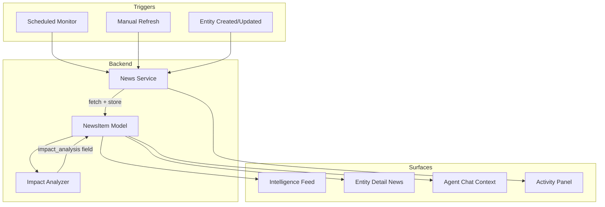

# Current Events Intelligence System

## The Problem

Jarvis has an `insight_agent.py` that can fetch company news via Tavily, but it is effectively dead code — no frontend calls it, nothing is persisted, nothing runs automatically. A VC firm needs current events woven in at every level: portfolio monitoring, dealflow diligence, trend awareness, and proactive alerting.

---

## What Already Exists (starting points)

- `**backend/app/agents/insight_agent.py**` — `fetch_company_insights()` returns `{headlines, summary}` via Tavily + LLM
- `**backend/app/services/web_search.py**` — Tavily search wrapper (`search_web()`)
- `**GET /companies/{company_id}/insights**` endpoint — exists but unused
- **Agent job system** (`AgentJob` model + activity panel) — background task tracking
- **RAG infrastructure** — per-company vector stores for document context
- **Agent chat** — streaming LLM chat with company context (but no web search in chat today)

---

## Architecture Overview

---

## Phase 1: Persistent News + Global Feed (MVP)

The foundation: store news, show it in the UI, let users refresh manually.

### 1a. NewsItem Model

New table `news_items` to persist fetched news so it is queryable, historical, and not re-fetched every view.

**Fields:**

- `id` (PK, UUID)
- `entity_type` (string: "company" | "portfolio" | "dealflow")
- `entity_id` (string: FK reference)
- `entity_name` (string: denormalized for display)
- `headline` (string)
- `url` (string, nullable)
- `snippet` (text, nullable)
- `summary` (text, nullable — LLM-generated)
- `impact_analysis` (text, nullable — Phase 2)
- `relevance_score` (float, nullable — Phase 2)
- `is_read` (boolean, default false)
- `is_flagged` (boolean, default false — for high-impact items)
- `fetched_at` (datetime)
- `created_at` / `updated_at`

**Files:** New `backend/app/models/news_item.py`, new `backend/app/schemas/news_item.py`.

### 1b. News Service

A service layer that orchestrates fetching, deduplication, and storage. Wraps `insight_agent.fetch_company_insights()`.

- `fetch_news_for_entity(entity_type, entity_id, db)` — fetch via Tavily, deduplicate by URL, store new items, return count added
- `fetch_all_portfolio_news(db)` — loop all `PortfolioSnapshot` records, call fetch per company
- `fetch_all_dealflow_news(db)` — loop all active `DealflowEntry` records
- `fetch_all_company_news(db)` — loop all `Company` records
- Deduplication: Skip if a `news_item` with the same `url` already exists for that entity

**File:** New `backend/app/services/news_service.py`.

### 1c. News Router (API)

- `GET /news` — list news items with filters (entity_type, entity_id, is_read, is_flagged, limit/offset)
- `POST /news/refresh/{entity_type}/{entity_id}` — manually refresh news for one entity
- `POST /news/refresh-all` — refresh news for all portfolio + dealflow + deal room companies
- `PATCH /news/{id}` — mark as read, toggle flagged
- `DELETE /news/{id}` — dismiss/remove a news item

**File:** New `backend/app/routers/news.py`. Register in `main.py`.

### 1d. Frontend: Intelligence Tab

A new top-level sidebar tab "Intelligence" (or "News") showing a global feed of all news items across portfolio, dealflow, and deal room.

- Chronological feed (most recent first)
- Filter by entity type (Portfolio, Dealflow, Deal Room)
- Filter by flagged / unread
- Each card shows: headline (linked), snippet, entity name (linked to detail page), time ago
- "Refresh all" button at the top
- Click headline opens URL in new tab; click entity name navigates to detail page

**File:** New `frontend/src/app/intelligence/page.tsx`.

### 1e. Frontend: Inline News on Entity Detail Pages

Add a "News" section/card to:

- Deal Room company detail page (`frontend/src/app/dealroom/[id]/page.tsx`) — could be a new tab or a card below overview
- Dealflow detail page (`frontend/src/app/dealflow/[id]/page.tsx`) — a card showing recent news
- Portfolio company page (if one exists, or inline on portfolio list)

Each shows the entity's news items + a "Refresh" button.

**Frontend API:** Add `newsApi` to `frontend/src/lib/api.ts` (list, refresh, markRead, flag, delete). Add `NewsItem` type to `frontend/src/types/index.ts`.

---

## Phase 2: Impact Analysis + Scheduled Monitoring

Make it smart and automatic.

### 2a. Impact Analysis Agent

After news is fetched, run an LLM pass that answers: "How does this news item affect our position?" This uses company context (RAG documents, deal terms, portfolio data) to generate a 2-3 sentence impact analysis.

- Extend `insight_agent.py` with `analyze_impact(headline, snippet, entity_name, entity_context)` function
- Store result in `news_items.impact_analysis`
- Run as background task after news fetch (same pattern as matchmaking)
- Display impact analysis in the news card UI (expandable section below headline)

### 2b. Relevance Scoring

Not all news is equally important. Use LLM to assign a relevance score (0-1) and auto-flag items above a threshold (e.g. 0.7).

- Add to the impact analysis LLM call: "Rate relevance 0-10"
- Store in `news_items.relevance_score`
- Auto-set `is_flagged = True` for high-relevance items
- Sort feed by relevance (option alongside chronological)

### 2c. Scheduled Background Monitoring

Run news fetching automatically on a schedule.

- Use APScheduler (lightweight, in-process) or a simple background thread with `asyncio.sleep()`
- Schedule: Every 6-12 hours for portfolio companies, every 24 hours for dealflow
- Create `AgentJob` records (type: `news_monitor`) so users see activity in the panel
- Only run if `TAVILY_API_KEY` is set

**File:** New `backend/app/services/scheduler.py`, integrated into `main.py` lifespan.

---

## Phase 3: Deep Integration

Wire news into every surface of the platform.

### 3a. Agent Chat with News Context

Enhance `_build_system_prompt()` in `agent_chat.py` to include recent news items for the current entity. When a user is chatting about a company, Jarvis should know what's been in the news.

- Query `news_items` for the entity, include top 5 headlines + summaries in system prompt
- Optionally add web search as a "tool" the chat agent can call mid-conversation (function calling)

### 3b. Sector/Trend Monitoring

Beyond company-specific news, monitor broader sector trends.

- New entity type: "sector" (ai, fintech, healthcare, etc.)
- Fetch news for "AI startups venture capital trends 2026" etc.
- Show sector news in the Intelligence feed with a "Trends" filter
- Could inform which dealflow companies to pay attention to

### 3c. Network/Person News

Monitor news about tracked persons and key network contacts.

- Extend news service to accept person names (LinkedIn profiles are harder to search)
- "Has this person made any public moves (new role, speaking, etc.)?"
- Show in tracked person and network contact detail pages

### 3d. Proactive Alerts

Push high-impact news to users rather than requiring them to check.

- When `relevance_score > threshold`, create an alert
- Show alert count badge on the Intelligence tab
- Optional: email digest (daily/weekly summary of flagged news)
- Toast notification in-app when high-impact news is fetched during a session

### 3e. News-Informed Matchmaking

When generating introduction suggestions, include recent news context.

- The `_enrich_reason()` function in `matchmaking.py` already accepts `current_events_summary` but never passes it
- Query recent news for the target company and pass the summary to `generate_intro_reason()`
- Result: "Introduce Jane to Acme Corp — they just announced a $50M Series B and Jane's fund focuses on this stage"

---

## Recommended Implementation Order

**Phase 1 (build now):** The MVP gives immediate value — users can see news, refresh manually, and have it persist. ~6-8 files changed/created.

**Phase 2 (next sprint):** Impact analysis and scheduling make it proactive and intelligent. Builds on Phase 1 data model.

**Phase 3 (iterative):** Each sub-feature (3a-3e) is independent and can be prioritized based on usage patterns. Chat integration (3a) and news-informed matchmaking (3e) are highest-leverage since they connect to existing workflows.

---

## Open Design Questions

1. **Tab placement:** Should "Intelligence" be a top-level sidebar item, or nested under an existing tab? A top-level tab makes it prominent and easy to check daily.
2. **News retention:** How long to keep news items? 30 days? 90 days? Forever with pagination?
3. **Tavily costs:** Each company refresh is ~1 API call. With 50 portfolio + 100 dealflow companies, a daily refresh is ~150 calls/day. Tavily's free tier is 1000 searches/month. May need a paid plan for scheduled monitoring.
4. **Phase 1 scope:** Should Phase 1 include the inline news on entity detail pages, or just the global Intelligence feed? Starting with just the feed is faster; inline can follow quickly.

