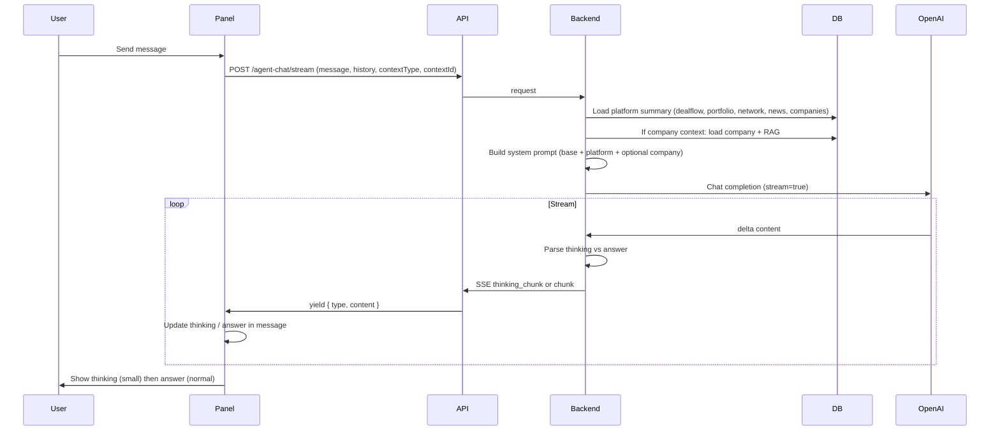

# Jarvis Full App Context and Cursor-Style Thinking UX

## Current state

- **Context**: Only **company** context is implemented in [backend/app/routers/agent_chat.py](backend/app/routers/agent_chat.py). When the user is on a deal room company page (`/dealroom/[id]`), `_build_system_prompt` adds that company’s details plus RAG chunks. On all other pages (dealflow, portfolio, network, intelligence), Jarvis gets no platform data.
- **Streaming**: Single stream of content chunks (`type: 'chunk'`). No separation of reasoning vs final answer.
- **Frontend**: [frontend/src/components/jarvis/agent-chat-panel.tsx](frontend/src/components/jarvis/agent-chat-panel.tsx) shows one assistant message body (Markdown); a single “thinking…” label appears in the header while streaming.

## 1. Full app context for Jarvis

**Goal**: Every chat request gets a concise summary of the whole platform so Jarvis can answer using dealflow, portfolio, network, intelligence, and deal room companies.

**Approach**: Extend `_build_system_prompt` in the backend to **always** append a “Platform context” section, then optionally add page-specific context (current company when `context_type === "company"`).

**Backend changes** ([backend/app/routers/agent_chat.py](backend/app/routers/agent_chat.py)):

- Add a helper (e.g. `_build_platform_context(db: Session) -> str`) that builds a bounded text summary by querying:
  - **Dealflow**: Count + recent entries (e.g. last 20) with name, stage, one-liner snippet, status.
  - **Portfolio**: Count + snapshot list (e.g. company_name, investment_stage, one_liner).
  - **Network**: Count + recent contacts (e.g. name, company_name, role_or_title, tags).
  - **Intelligence**: Count + recent news items (e.g. headline, entity_name, importance, snippet or insight).
  - **Deal room (companies)**: Count + company names and one-liners (from `Company` table).
- Keep each section short (e.g. 1–2 lines per item, hard cap per section) to avoid blowing context length.
- In `_build_system_prompt`, call this helper and append “Platform context:\n{…}” to the base prompt. Retain existing behavior: when `context_type == "company"` and `context_id` is set, still add “Current context: Company …” and RAG as today.

**Data access**: Use existing models and `db` (e.g. `DealflowEntry`, `PortfolioSnapshot`, `NetworkContact`, `NewsItem`, `Company`). No new API endpoints; context is built server-side per request.

**Optional**: Add a short “Platform context” section in the empty state of the chat panel (e.g. “Jarvis has context from dealflow, portfolio, network, intelligence, and deal room”) so users know they can ask about anything.

---

## 2. Cursor-style “thinking” then “answer” UX

**Goal**: Show the model’s step-by-step reasoning in **lighter, smaller text**, then the final answer in normal styling, similar to Cursor.

**Constraint**: OpenAI’s API does not expose reasoning tokens as a separate stream; reasoning models (e.g. o1) do not stream thinking. So we use a **prompt-based** approach with a single model (e.g. existing gpt-4o-mini): ask the model to emit a `<thinking>...</thinking>` block first, then the answer.

**Backend** ([backend/app/routers/agent_chat.py](backend/app/routers/agent_chat.py)):

- **System prompt**: Add instructions so the model first outputs its reasoning inside exactly `<thinking>...</thinking>`, then the final answer. E.g. “When responding, first briefly show your reasoning or steps in a single block wrapped in the exact XML tags .... Then provide your concise final answer after that block.”
- **Stream parsing**: In `_stream_chat`, parse the stream and emit two event types:
  - `thinking_chunk`: content that belongs inside `<thinking>...</thinking>`.
  - `chunk`: content that belongs to the final answer (after `</thinking>`).
  - Implementation: buffer incoming delta content; when the buffer contains `<thinking>`, switch to emitting `thinking_chunk`; when it contains `</thinking>`, flush remaining thinking, then emit subsequent content as `chunk`. If the model never emits the tags, treat all content as `chunk` (backward compatible).
- **Token handling**: Handle partial tags (e.g. `<think`) by only switching state when a full tag is seen; keep a small buffer (e.g. up to 20 chars) to detect `</thinking>`.

**Frontend** ([frontend/src/components/jarvis/agent-chat-panel.tsx](frontend/src/components/jarvis/agent-chat-panel.tsx) and types):

- **Message shape**: Support assistant messages with optional “thinking” and “answer” parts. For example, extend the in-memory message type to `{ role: 'assistant', thinking?: string, content: string }` where `content` is the final answer and `thinking` is the reasoning (optional).
- **Streaming**: In the stream loop, handle `thinking_chunk` and `chunk`: append to `thinking` and `content` respectively. When both are present, show both in the same message bubble.
- **UI**:
  - **Thinking block**: Render `thinking` (if any) in smaller, muted text (e.g. `text-xs text-muted-foreground`), possibly in a subtle container, above the main answer. Stream it so it appears as the model “thinks.”
  - **Answer block**: Render `content` with existing Markdown styling (`prose prose-sm`).
- **API client** ([frontend/src/lib/api.ts](frontend/src/lib/api.ts)): No change to the generator signature; it already yields `{ type, content }`. The new event types `thinking_chunk` and `chunk` are just new `type` values; the consumer in the panel handles them.

**Edge cases**: If the model outputs raw `<thinking>` in the answer (rare), the parser might misattribute. We can keep the logic simple and document that the model should only use the tags once at the start; optional later improvement could be to use a more distinctive delimiter.

---

## 3. Data flow summary

---

## 4. Files to touch

| Area        | File                                                                                                       | Changes                                                                                                                                                                        |
| ----------- | ---------------------------------------------------------------------------------------------------------- | ------------------------------------------------------------------------------------------------------------------------------------------------------------------------------ |
| Backend     | [backend/app/routers/agent_chat.py](backend/app/routers/agent_chat.py)                                     | Add `_build_platform_context(db)`; extend `_build_system_prompt` to include it and thinking instructions; in `_stream_chat`, parse stream and emit `thinking_chunk` / `chunk`. |
| Frontend    | [frontend/src/components/jarvis/agent-chat-panel.tsx](frontend/src/components/jarvis/agent-chat-panel.tsx) | Assistant message state: optional `thinking` + `content`; handle `thinking_chunk` and `chunk` in stream loop; render thinking block (small/muted) above answer.                |
| Types / API | [frontend/src/lib/api.ts](frontend/src/lib/api.ts)                                                         | Optional: export or document that stream events may include `type: 'thinking_chunk'` and `type: 'chunk'`. No signature change.                                                 |

---

## 5. Testing and rollout

- **Context**: Manually test from dealflow, portfolio, network, intelligence, and deal room; ask “What’s in our dealflow?” / “Summarize our portfolio” / “Any recent news?” and confirm answers use platform data. When on a company page, confirm company-specific + RAG context still applies.
- **Thinking UX**: Send a question that invites reasoning (e.g. “Why might we pass on this company?”); confirm thinking appears in smaller text and the final answer below it. Confirm that when the model doesn’t use `<thinking>`, the whole response still shows as the answer.

